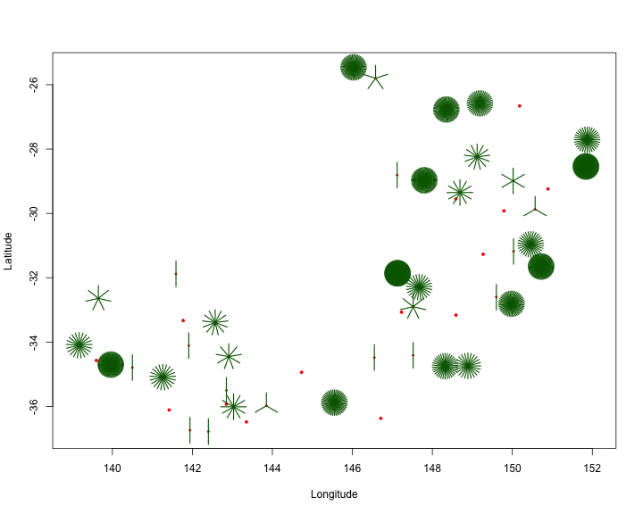
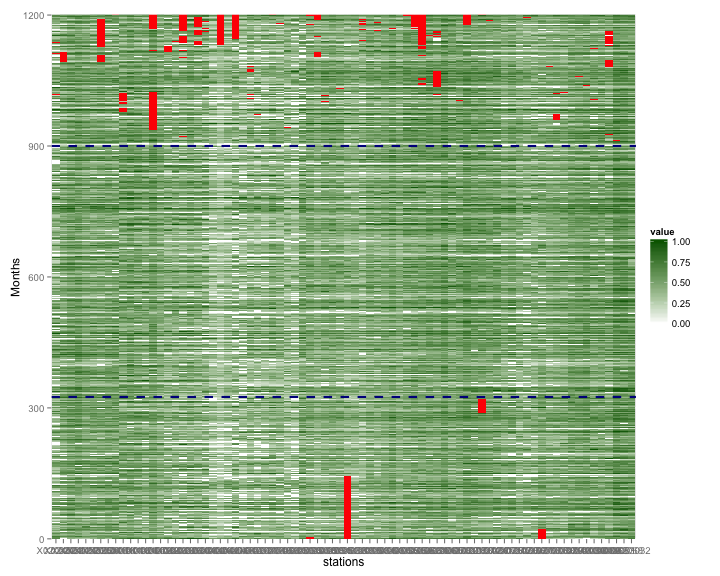
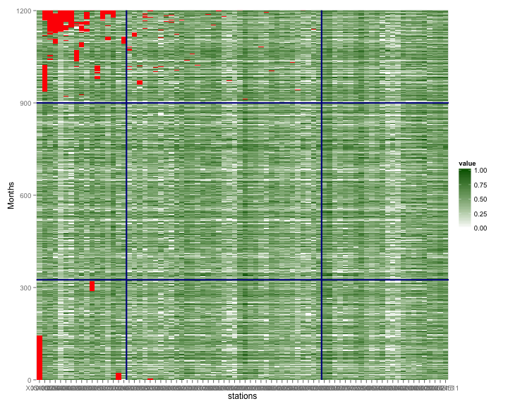
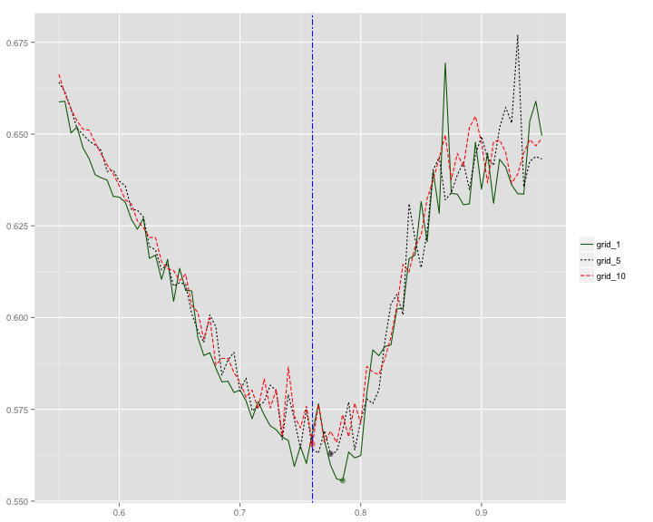
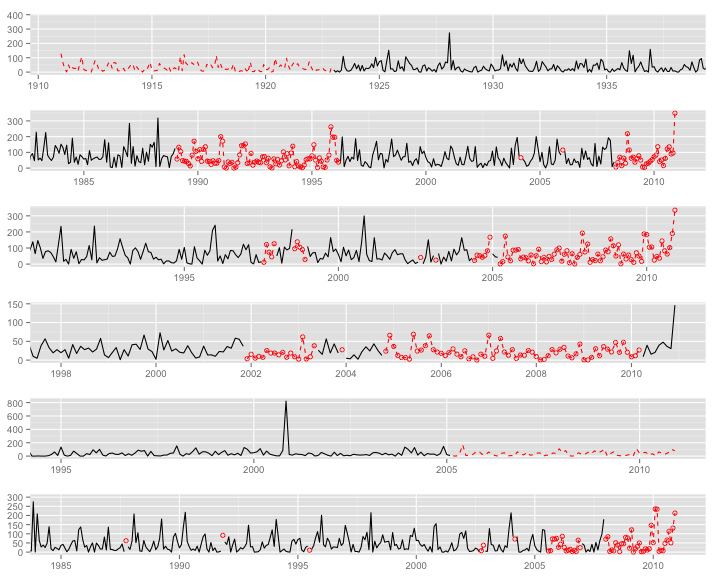
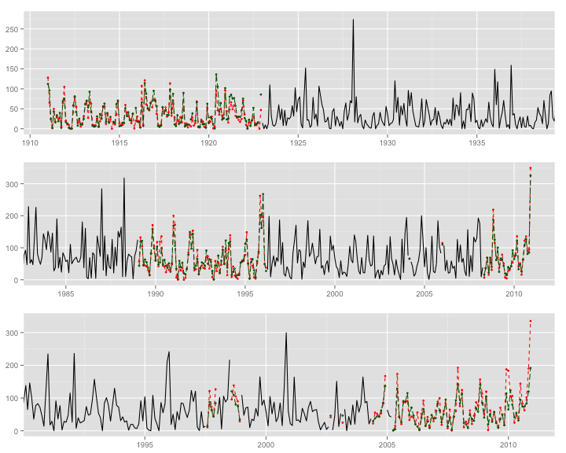
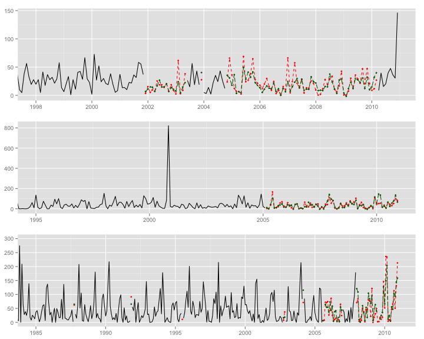

% Missing Value Imputation for Spatio-Temporal Data Analysis: A Case Study
% Lingbing Feng
% 2012/09/17

# Missing Value


---


# Agenda

* Motivation
  - What is Spatio-Temporal & Imputation
	- Why it it important & difficult	
	- What is our aim?
* Related Literature
	
* Methods
    - SVD
    - CUTOFF
* Case Study in Australia

* Potential and Future Work

	
	 

# Spatio-Temporal Data


***Spatio-temproral data: data with spatial (geographic), temporal components, and attributes.***

* Where  ------ space

* when   ------ time

* what   ------ attributes

*You can think it as a set of multivariate time series that are geographically distributed*


# Examples

* Climatic readings ( temperature, rainfall, riverflow, etc. ) for a number of nearby stations

* Satellite images of parts of the earth

* Election results for voting districts and a number of consecutive elections

* GPS tracks for people or animal possibly with additional sensor readings

* Desease outbreaks or volcano eruption

* …

# what is imputation and why?

* Filling Missing values, completing the incomplete data

* For data structure consistency, and ultimately for modelling 

* Model estimating procedure assumes fairly completeness upon the data matrix

* If there were missing values in your data, sooner or later, you would have to face the problem.


# It is difficult when

* You take it seriously, rather than saying:*"Here we have chosen to ignore the missing values"*, or *"For the sake of convenience, we case-wise delete all the missing values"*

* You take it very seriously, and you want to impute the missing value by incorporating as much valuable information as possible. 

* You take it extremly seriously, and you want an algorithm which is intuitively simple, credible, and computational efficient.

# Our aim 

* To develope a simple, intuitive method to impute spatio-temporal data before modelling

* which takes both spatial and temporal information into consideration

* and we hope it'd be faster than some accepted methods


# What have we achieved


* Developed a method which is very simple and intuitive

* Applied it to a monthly rainfall data

* Some tools that are useful when dealing with spatio-temporal missing problem


# Related Literature (cont'd)

* Schneider (2001) proposes a parametric method that makes use of E-M algorithm and ridge regression to estimate the mean and covariance matrix of the data iteratively. (*spatially weak, and no package supported*)

* Kondrashov et al. (2006) developes an novel, iterative form of M-SSA (Multi-channel Singualr Spectrum Analysis) approach which utilizes temporal, as well as spatial correlations (as they claimed so) to fill in gaps.

* It raised a heat debate (Schneider (2006)'s interesting comment and Kondrashov et al.'s rejoinder)

# We found

* K's idea comes down to matrix decomposition and EM algorithm

* The cross-validation procedure used in their paper is vague and difficult to understand

* Heavily relying on the MAR (Missing At Random) assumption, which sometimes, is not the truth


# SVD imputation


* Fuentes et al.(2006), it is stable and reasonble 

* partly nonparametric, E-M like, counld be used before modelling

* standard imputation method in the `SpatioTemporal` R pakage 

We consider it as the competetor 


# Methods: SVD 

* Assume a typical S-P data set comprises $x$ monitoring sites and each site has $t$ observations. This S-P process can be modelled as 
$$Z(s,t)=\mu(s,t)+\varepsilon(x,t)$$
and thus $$\mathbf{Z}=\mathbf{M}+\mathbf{E}$$
* $\mathbf{M}$ is the trend component and $\mathbf{E}$ is the resudual component. M can be modelled by using SVD. so $$\mathbf{M}=\mathbf{F\cdot B}$$
* $F=[f_{0}(t)\, f_{1}(t)\, \cdots\, f_{J}(t)]$ being a $T\times J$ matrix. [basis functions, $f_{0}(t)\varpropto\mathbf{1}$]. So matrix $\mathbf{b}$ is the matrix of trend coefs for the N sites.
* Dimensionality reducing by Taking $\mathbf{F}$ to be the first $J$ left singualr vectors of the singular value decompostion $\mathbf{Z=UDV^{'}}$
* SVD would fail if there is missing value, so Fuentes et al. suggestes...

# cont'd (the `SVD.miss()` does so)

* Specify a rank $J$, default to be 4
* $\mu_{1}$ is row means of $\mathbf{Z}$, that is the mean values for non-missing values at each time point across all sites. Replace all NAs in $\mathbf{Z}$ with zeros. 
* Regression through each column of $\mathbf{Z}$ on the initial regressor $\mu_{1}$ and filling the missing values by the fitted values of the regression on that column. Assume $Z_{(i,j)}$ were missing, then it would be replaced by $\alpha_{j}\centerdot\mu_{1(i)}$, where $\alpha_{j}$ is the regression coef by regressing the $j^{th}$ column of $\mathbf{Z}$ on $\mu_{1}$.
* Compute the $J$ SVD approximation of the imputed matrix and do regression of each column of the new data matrix on the $J$ vectors of basis function. The originally missed values are then replaced by the fitted values of this new regression.
* Repeat the SVD and regression until convergence.

# anyway

* The SVD method involves a iterative process of matrix decompisition and regression.
* initializing -> reg(1) -> SVD -> reg -> SVD -> reg -> ...
* Works well when most of the sites share sonme similar temporal patterns
* Be watchful when obs have a substantial variation around the trend, the SVD approx might be a noisy representation of the real pattern
* I reckon the SVD method as being partly temporal imputation rather than spatio-temporally

# `CUTOFF` method: notations (take monthly data for example)
Let $x_{(i,j),k}$ be the observation in month $i$ of year $j$ in station $k$. Assume a particular $x_{(i^{*},j^{*}),k^{*}}$ was missing, we call the month $i^{*}$ a candidate month, the year $j^{*}$ and the station $k^{*}$ a candidate station.For each missing value, we complete it by following steps:

* create a **Reference file** with a few stations that have a high correlation ($\rho$) with the candidate station. We have developed a cross-validation plus a simulation procedure to choose the optimal $\rho$.
* Let $L_{k}$ denote the set of reference station for $k_{th}$ station, and let $J_{i,k}$ denote the set of years for which $x_{(i,j),k}$ is not missing for month $i$ and station $k$, excluding year $j^{*}$.
* letting $\bar{R}$ be the mean value of observations in the reference file including all available points in years $j$ (not including the candidate year) in month $i$, $\bar{C}$ the mean value of observations in year $j$ in month $i$ for that special candidate station and $R$ the mean of $l$ reference stations in that particular month $i$ and year $j$ ( "R" is the initial of "Reference" and "C" is of "Candidate" ), so

# `CUTOFF` method:(cont'd)

$$
\begin{eqnarray}
\bar{R} & = & \frac{\underset{k\in L_{k^{*}}}{\sum}\underset{j\in J_{i^{*},k}}{\sum}x_{(i^{*},j),k}}{\underset{k\in L_{k^{*}}}{\sum}|J_{i^{*},k}|}\nonumber \\
R & = & \frac{\underset{k\in L_{k^{*}}}{\sum}x_{(i^{*},j^{*}),k}}{|L_{k^{*}}|}\\
\bar{C} & = & \frac{\underset{j\in J_{i^{*},k^{*}}}{\sum}x_{(i^{*},j),k^{*}}}{|J_{i^{*},k^{*}}|}\nonumber 
\end{eqnarray}
$$
* Let $\hat{x}$be the imputed value for the candidate value , assuming equation below holds
$$
\frac{\hat{x}}{R}=\frac{\bar{C}}{\bar{R}}
$$
then 
$$
\hat{x}=R\cdot\left(\dfrac{\bar{C}}{\bar{R}}\right)
$$

# `CUTOFF` method: adjustments (cont'd)

* Some stations may have no reference file when the cut-off value is big. If so, we set the nearest station as the reference station no matter what the cut-off value is.
* If we have done above, then every station should have at least one reference station. However, even so, if by any chance for a candidate station which is missing in a certain time point, the observations in the reference station(s) are missing too, which means it is impossible to compute $R$, then the whole imputation would fail. In the CUTOFF method, this case is circumvented by keeping tracking down the reference list to find a station that is not missing in that time point. Here, the reference list includes all stations sorted by correlation with the candidate station. 
* There is only one case we could imagine that would fail the whole imputation if we stick to thesteps above-listed, that is when there is a whole row missing. All otherwise cases would be fine imputed by our method.

# Case Study in Australia: Data and EDA

* Murray-Darling Basin, 78 gauging stations
* 100 years' monthly data (Jan 1911 - Dec 2010)
* Rainfall

# Representation (Space-wide format)

* Different columns reflect different stations


```
         date X048039 X049023 X050004 X050018 X050028 X050031 X050052
1  1911-01-01    33.2    58.3      NA    80.2    95.0   189.4   116.4
2  1911-02-01   149.5   133.6      NA    60.2    70.1    57.2    68.9
3  1911-03-01    14.0    22.8      NA    17.8    41.2    30.0    42.4
4  1911-04-01     0.0     0.8     8.1     0.0     0.0     0.0     0.4
5  1911-05-01    47.4    39.9    42.0    72.0    61.3    45.5    31.1
6  1911-06-01     6.6    23.0    16.5    16.3    12.9    30.5    13.4
7  1911-07-01     7.1    24.9    44.7    38.3    38.7    45.4    26.5
8  1911-08-01     1.8    20.5    19.1    54.6    30.5    13.2     4.5
9  1911-09-01    26.9    37.1    34.6    31.0    19.7    49.6    42.6
10 1911-10-01     1.3     8.4    14.0     2.5     9.7    10.9     8.0
```


# locations

<!-- Map generated in R 2.15.1 by googleVis 0.2.17 package -->
<!-- Tue Sep 11 21:01:20 2012 -->


<!-- jsHeader -->
<script type="text/javascript" src="http://www.google.com/jsapi">
</script>
<script type="text/javascript">
 
// jsData 
function gvisDataMissing_Counts ()
{
  var data = new google.visualization.DataTable();
  var datajson =
[
 [
      -32.64,
     139.65,
"20020" 
],
[
       -34.1,
     139.17,
"24501" 
],
[
      -34.18,
     139.08,
"24511" 
],
[
       -35.3,
     139.03,
"24515" 
],
[
      -35.12,
     139.27,
"24521" 
],
[
      -34.57,
      139.6,
"24535" 
],
[
       -34.7,
     139.96,
"25004" 
],
[
      -35.26,
     140.91,
"25015" 
],
[
      -34.79,
      140.5,
"25018" 
],
[
      -27.71,
     151.87,
"41011" 
],
[
      -28.23,
     152.07,
"41013" 
],
[
      -27.21,
     151.85,
"41024" 
],
[
      -26.78,
     151.11,
"41050" 
],
[
      -28.54,
     151.84,
"41079" 
],
[
      -27.72,
     151.63,
"41082" 
],
[
      -28.24,
     149.12,
"42003" 
],
[
      -26.66,
     150.18,
"42023" 
],
[
      -26.77,
     148.35,
"43026" 
],
[
      -27.15,
     149.07,
"43035" 
],
[
      -26.58,
     149.19,
"43038" 
],
[
       -25.8,
     146.58,
"44002" 
],
[
      -26.77,
     148.35,
"44026" 
],
[
      -28.97,
      147.8,
"44042" 
],
[
      -28.81,
     147.12,
"44054" 
],
[
      -25.46,
     146.03,
"44168" 
],
[
      -30.85,
     143.09,
"46042" 
],
[
      -33.39,
     142.57,
"47029" 
],
[
      -31.88,
     141.59,
"47031" 
],
[
      -33.43,
     142.57,
"47033" 
],
[
      -33.33,
     141.77,
"47045" 
],
[
      -34.11,
     141.91,
"47053" 
],
[
      -29.55,
     148.59,
"48031" 
],
[
      -29.32,
     145.85,
"48039" 
],
[
      -29.32,
     145.85,
"49023" 
],
[
      -34.45,
     142.91,
"50004" 
],
[
      -32.29,
     147.67,
"50018" 
],
[
       -32.9,
     147.52,
"50028" 
],
[
      -32.73,
     148.19,
"50031" 
],
[
      -33.07,
     147.23,
"50052" 
],
[
      -31.86,
     147.13,
"51033" 
],
[
      -31.99,
     147.95,
"51049" 
],
[
      -29.35,
     148.69,
"52019" 
],
[
      -29.92,
     149.79,
"53003" 
],
[
      -28.99,
     150.02,
"53018" 
],
[
      -30.38,
     150.61,
"54003" 
],
[
      -29.87,
     150.57,
"54004" 
],
[
      -29.24,
     150.89,
"54036" 
],
[
      -31.18,
     150.03,
"55045" 
],
[
      -30.96,
     150.46,
"55055" 
],
[
      -31.65,
     150.72,
"55063" 
],
[
       -32.6,
      149.6,
"62021" 
],
[
      -32.81,
     149.98,
"62026" 
],
[
      -33.43,
     149.56,
"63005" 
],
[
      -31.27,
     149.27,
"64008" 
],
[
      -33.16,
     148.59,
"65022" 
],
[
      -34.74,
     148.89,
"70028" 
],
[
      -35.16,
     147.46,
"72150" 
],
[
      -34.75,
     148.32,
"73012" 
],
[
      -34.41,
     147.52,
"73038" 
],
[
      -34.48,
     146.55,
"74007" 
],
[
      -35.55,
     144.95,
"74128" 
],
[
      -35.42,
      144.6,
"75012" 
],
[
      -33.61,
     146.32,
"75050" 
],
[
      -34.94,
     144.73,
"75056" 
],
[
      -34.23,
     142.08,
"76031" 
],
[
      -35.09,
     141.26,
"76063" 
],
[
      -35.93,
     142.85,
"77008" 
],
[
      -36.01,
     143.03,
"77030" 
],
[
       -35.5,
     142.85,
"77039" 
],
[
      -36.11,
     141.42,
"78043" 
],
[
      -36.78,
      142.4,
"79010" 
],
[
      -36.74,
     141.94,
"79036" 
],
[
      -35.98,
     143.85,
"80004" 
],
[
      -36.48,
     143.35,
"80009" 
],
[
      -35.88,
     145.55,
"80065" 
],
[
      -36.37,
     146.71,
"82001" 
],
[
      -36.53,
     147.37,
"82068" 
],
[
      -36.85,
     146.32,
"83032" 
] 
];
data.addColumn('number','Latitude');
data.addColumn('number','Longitude');
data.addColumn('string','id');
data.addRows(datajson);
return(data);
}
 
// jsDrawChart
function drawChartMissing_Counts() {
  var data = gvisDataMissing_Counts();
  var options = {};
options["showTip"] = true;
options["enableScrollWheel"] = true;
options["mapType"] = "hybrid";
options["useMapTypeControl"] = true;
options["width"] =    800;
options["height"] =    600;

     var chart = new google.visualization.Map(
       document.getElementById('Missing_Counts')
     );
     chart.draw(data,options);
    

}
  
 
// jsDisplayChart 
function displayChartMissing_Counts()
{
  google.load("visualization", "1", { packages:["map"] }); 
  google.setOnLoadCallback(drawChartMissing_Counts);
}
 
// jsChart 
displayChartMissing_Counts()
 
<!-- jsFooter -->  
//-->
</script>
 
<!-- divChart -->
  
<div id="Missing_Counts"
  style="width: 800px; height: 600px;">
</div>


# Missing Pattern (spatially)

 


# Structure Heatmap (temporally, original spatial order)

```r
source("functions.R")
HeatStruct(hqmr.cube) + opts(axis.text.x = NULL) + geom_hline(yintercept = c(325, 
    900), col = "darkblue", lty = 2, lwd = 1)
```

```
## Warning: 'ggpcp' is deprecated. See help("Deprecated")
```

```
## Warning: 'opts' is deprecated. Use 'theme' instead. See help("Deprecated")
```

 


# Structure Heatmap (reordered by missingness)

```
## Warning: 'ggpcp' is deprecated. See help("Deprecated")
```

```
## Warning: 'opts' is deprecated. Use 'theme' instead. See help("Deprecated")
```

 


# Cross-Validation

* grid-wise
  * 10 fold on the columns
  * different row size (1 year, 5 years, 10 years)
* randomization (both on rows and columns)
* Mean-RMSE for each CUTOFF value from 0.55-0.95, by 0.05

# CV results
 


# Performance (CUTOFF)
 


# Comparison 
 


# Comparison (more)

 


# Simulation

* Capturing the Missing pattern (block Missing and dot missing)
* Knowing the real value in advance (the middle chunk complete data)
* In a word: 

# Heat Structure (Transformed $ Reordered)

# Simulation workhorse (a missing vector)

* *n*: length of the vector
* *maxlen*: max length of missing block 
* *prob*: fixed probability of being missing for each obs
* *cnst*: a constant for controlling the probability increment, which is $$ prob^{*}=\frac{count+cnst}{maxlen+cnst}$$

# One simulation

# Conclusion

# Outlook and future work


